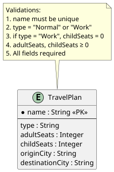
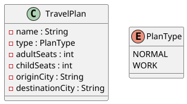
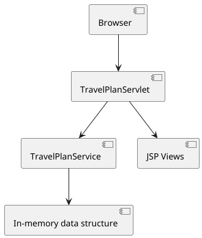

# Travel Plans Management Application

A web application for creating and managing travel plans, developed as a technical test.

## Features

### Core Functionality
- Create travel plans with all required fields
- View all plans in a table below the form
- Edit existing plans (name is read-only during editing)
- Delete plans with confirmation dialog
- Group compatible plans by type, origin city, and destination city
- Switch views between grouped plans and full list

### Business Validations
- All fields are mandatory
- Travel plan names must be unique
- Adult and child seats must be zero or positive
- Work travel plans cannot have child seats

## Technology Stack

### Backend
- Java 8
- Servlet API 3.1 (Tomcat 9)
- JSP (JavaServer Pages)
- Maven

### Frontend
- Bootstrap 3.4.1 (CDN) 
  - Used for layout and basic styling only (no JS components)
- HTML5
- Basic JavaScript (confirmation dialogs only)

### Architecture
- Model: `TravelPlan`, `PlanType`
- Service: `TravelPlanService` (business logic)
- Controller: `TravelPlanServlet` (HTTP handling)
- View: `index.jsp` (single-page interface)

## Getting Started

### Prerequisites
- Java 8
- Apache Maven 3.6+
- Apache Tomcat 9+

### Installation & Deployment

1. **Build the application:**
   ```bash
   mvn clean package
   
2. **Deploy to Tomcat 9:**
- Copy `target/travel-plans.war` to Tomcat's `webapps/` directory
- Start Tomcat server

3. **Access the application:**
   ```text
    http://localhost:8080/travel-plans/

## How to Use

### Creating a Travel Plan
1. Fill all fields in the form
2. Click "Create Plan"
3. The plan appears immediately in the table below

### Editing a Plan
1. Click "Edit" on any plan row
2. Modify the fields (name cannot be changed)
3. Click "Update Plan"

### Deleting a Plan
1. Click "Delete" on any plan row
2. Confirm the deletion in the dialog
3. The plan is removed from the list

### Grouping Compatible Plans
1. Click "Group Compatible Plans"
2. View appears with:
   - Grouped tables for compatible plans (same type/origin/destination)
   - Separate table for unique plans (no compatibility)
3. Click "View All Plans" to return to normal view

### Compatibility Rules
Two or more plans are compatible when they have:
- Same plan type (Normal/Work)
- Same origin city
- Same destination city

## Requirements Met

### Technical Requirements:
- ✅ Java 8 development
- ✅ JSP with HTML/Bootstrap 3
- ✅ No database (in-memory storage)
- ✅ Logical ER diagram (design only)
- ✅ Form for creating travel plans
- ✅ Table display below form
- ✅ Edit and delete functionality
- ✅ Group compatible plans button
- ✅ Separate tables for compatible/unique plans
- ✅ Return to normal view button

### Business Validations:
- ✅ Work plans cannot have child seats
- ✅ No duplicate plan names
- ✅ All fields mandatory
- ✅ No negative seat numbers

## Diagrams
The following diagrams are included in the `docs/` folder:
1. **Entity Relationship Diagram** - Database structure design
- 
2. **Domain Class Diagram** - Java classes structure
- 
3. **Component Diagram** - Application architecture
- 

## Technical Decisions

### Architecture
1. **Single JSP Page:** Combines form and table as specified
2. **In-Memory Storage:** HashMap for simplicity
3. **Servlet Controller:** Handles HTTP requests
4. **Service Layer:** Contains business logic and validation

### Validation Strategy
1. **Client-side:** HTML5 validation (required, min attributes)
2. **Server-side:** Comprehensive validation in TravelPlanService
3. **Error Handling:** User-friendly error messages

## Testing

### Manual Test Cases
1. Create Plan with valid data
2. Edit existing plan
3. Delete plan with confirmation
4. Test validation errors (duplicate names, negative seats, etc.)
5. Group compatible plans
6. Test work plans with child seats validation

### Test Data Examples
- Normal plan: Madrid → Barcelona, 2 adults, 1 child
- Work plan: Madrid → Valencia, 1 adult, 0 children
- Compatible plans: Same type/origin/destination
- Unique plans: Different type/origin/destination